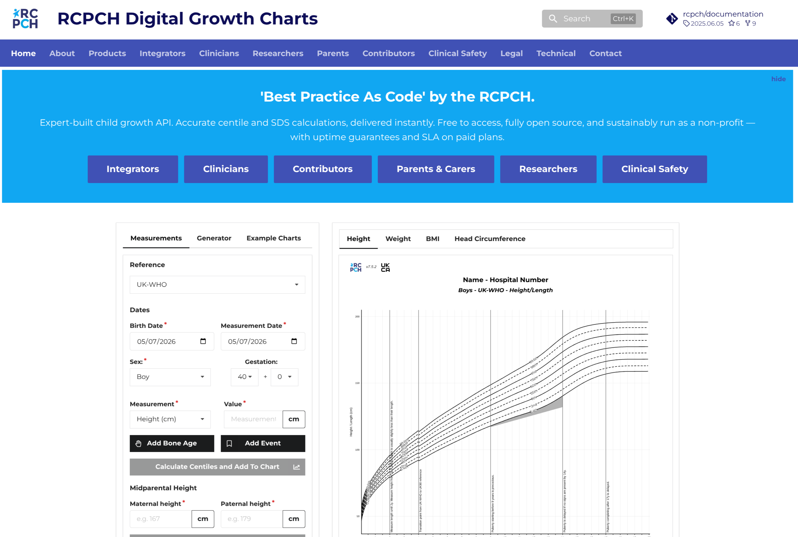

# RCPCH Digital Growth Charts Documentation

[](https://github.com/rcpch/digital-growth-charts-documentation/actions/workflows/docs-quality.yml)
[](https://github.com/rcpch/digital-growth-charts-documentation/actions/workflows/workflow-security.yml)

This repository is the authoritative public documentation for the RCPCH Digital Growth Charts platform. It covers implementation, clinical use, product information, clinical safety, regulation, legal matters, and contribution workflows; the clinical calculation engine and API service are maintained in their own repositories.

The production site is [growth.rcpch.ac.uk](https://growth.rcpch.ac.uk). It is built with [Zensical](https://zensical.org/) and deployed to Azure from the protected `live` branch.



## Status

The documentation is actively maintained. Some clinical safety and regulatory documents are controlled records; changes to them require the review defined in [`.github/CODEOWNERS`](.github/CODEOWNERS).

## Audience

The site serves implementers, clinicians, researchers, parents and carers, contributors, clinical safety officers, and regulatory or compliance stakeholders.

## Quick Start

Prerequisites: [Docker Engine](https://docs.docker.com/engine/install/) and [Docker Compose](https://docs.docker.com/compose/install/).

Clone the repository and run:

```bash
./s/docs
```

This builds and starts the documentation environment through Docker Compose, serves the site at <http://localhost:8001>, and opens it in a browser. See [Writing Documentation](docs/developer/writing-documentation.md) for the full contribution workflow.

## Quality Checks

Run the same checks used by pull-request CI before committing:

```bash
./s/lint
./s/spellcheck
./s/check-docs-nav
./s/linkcheck
./s/build-pdf
./s/audit
```

## Clinical Safety And Security

Read [`SAFETY.md`](SAFETY.md) before changing clinical, safety, regulatory, or quality-management material. Report suspected vulnerabilities privately as described in [`SECURITY.md`](SECURITY.md); do not put credentials, exploit details, or patient information in public issues.

## Contributing

Use a descriptive branch and open a pull request into `live`. Repository-specific guidance for coding agents is in [`agent-instructions.md`](agent-instructions.md). General defects and proposals can be raised through the [issue tracker](https://github.com/rcpch/digital-growth-charts-documentation/issues).

## Licence

Written documentation is licensed under [CC BY-SA 4.0](https://creativecommons.org/licenses/by-sa/4.0/). Minimal project-specific code is licensed under the MIT License. See [`LICENSE`](LICENSE) for the complete terms and [Licensing And Copyright](docs/legal/licensing-copyright.md) for component and third-party context.
