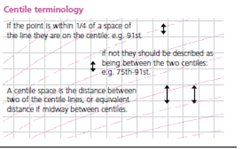

# Chart information for Health staff

## How the UK-WHO Charts work

The UK–WHO growth chart combines World Health Organization (WHO) standards with UK 1990 preterm and birth data:

| Age range | Data source |
|-----------|-------------|
| Preterm and birth measurements (23–42 weeks gestation) | UK90 (British children measured around 1990) |
| 2 weeks to 4 years | WHO growth standard from healthy, breast-fed children |
| 4 years to 20 years | UK 1990 growth reference |

The principal aim of the charts is to show healthy growth patterns for all children regardless of feeding method or ethnicity.

## Reason for combining UK 1990 and WHO 2006

The UK 1990 data includes both breast-fed and bottle-fed children. The WHO 2006 cohort of exclusively breast-fed children provides more accurate growth standards for ages 2 weeks to 4 years.

The final dataset has 4 parts:

1. Pre-term (up to 42 weeks)
2. Infants (under 2 years)
3. WHO 2006 children (< 4 years)
4. UK 1990 children (4 years - 20 years)

There's a visible step in the charts at data set junctions, which is deliberate. Smoothing over this disjunction would require us to 'make up' data for that gap. Another step occurs at age 2 when children transition from lying to standing measurements.

## Instructions for the Down Syndrome charts

The PDF linked below was produced in 2012 to accompany the Down Syndrome charts. In due course, we will update and reformat the text and adapt the presentation for the API version of the charts. Note that the Down Syndrome AAP (USA) reference is also supported.

[PDF Down Syndrome Chart Information (2012)](../_assets/_pdfs/2012-instructions-for-downs-syndrome-charts.pdf)

## Growth chart papers

For key publications on UK-WHO growth chart development, implementation, and validation, see [Growth chart papers](growth-chart-papers.md).

## Centile Terminology

--8<-- "docs/_assets/_snippets/centile-terminology.md"

- **Weight**: use only Class III clinical electronic scales in metric setting.
- **Length**: (before 2 years of age): proper equipment is essential (length board or mat). Staff performing the measurement should have received training on how to do it properly.
- **Height**: (from 2 years): position head and feet as illustrated, with child standing as straight as possible. Measure height recorded to the last millimetre. A correctly installed stadiometer, or approved portable measuring device rigid rule with T piece, is the only equipment that can be reliably used.
- **Head circumference**: use a narrow plastic or paper tape to measure where the head circumference is greatest.

## Frequently Asked Questions

### When should I weigh a child?

Weigh babies in the first week as part of feeding assessment. Once feeding is established, weigh at around 8, 12 and 16 weeks and 1 year during routine immunisations.

If concerned about [faltering growth](https://pathways.nice.org.uk/pathways/faltering-growth#content=view-node%3Anodes-monitoring), measure more often **but no more than**:

- Daily if less than 1 month old
- Weekly between 1–6 months old
- Fortnightly between 6–12 months
- Monthly from 1 year of age

### When should I measure length or height?

Measure length or height whenever concerned about a child's weight gain, growth or general health. Measure length until age 2; measure height after age 2. Height is usually slightly less than length.

### How should weight loss after birth be monitored?

Most babies lose weight in the first 3-4 days but regain birth weight by 3 weeks. Assess carefully if weight loss exceeds 10% or recovery is slow.

Calculate percentage weight loss:

For example, a child born at 3.500kg who drops to 3.150kg at 5 days has lost 350g or 10%; in a baby born at 3.000kg, a 300g loss is 10%.

### What is a normal rate of weight gain and growth?

Babies grow at different rates. Weight often doesn't follow a particular centile line, especially in the first year. Weight usually tracks within one centile space.

Acute illness can cause sudden weight loss and centile falls, but weight typically returns to normal within 2–3 weeks. A sustained drop through 2 or more centile spaces is unusual (fewer than 2% of infants) and requires assessment.

Successive length/height measurements in pre-school children often show wide variation. Most healthy children show a stable average position over time.

UK children have relatively large heads compared to WHO standards, particularly after 6 months. A head circumference below the 2nd centile occurs in only 1 in 250 children after 6 weeks. A head circumference above the 99.6th centile, or crossing upwards through 2 centile spaces, should only cause concern if there's a continued rise after 6 months, or other signs.

### Why do the length/height centiles change at 2 years?

Growth standards show length data up to 2 years and height from age 2 onwards. When measured standing, the spine compresses slightly, making height slightly less than length. Centile lines shift down at age 2 to allow for this.

### When is further assessment required in school aged children?

Assess further if any of these occur:

- Weight, height or BMI below the 0.4th centile (unless already investigated)
- Height centile more than 3 centile spaces below mid-parental centile
- Drop in height centile position of more than 2 centile spaces (after excluding measurement error)
- Smaller centile falls or discrepancies between child's and mid-parental centile, if in combination or associated with possible underlying disease
- Any other concerns about the child's growth

### How do SDS charts work?

Centiles derive from standard deviation scores (SDS or z scores). An SDS of 0 equals the 50th centile. Positive values relate to centiles above this; negative values relate to centiles below.

SDS values can all be plotted on the same chart. When plotting z scores against age, use _corrected_ age, not _chronological_ age.

## Calculations as yet not implemented in the API

### Weight–height to BMI conversion chart

^2)

BMI indicates how heavy a child is relative to height. It's the simplest measure of thinness and fatness from age 2 when height can be measured accurately.

In children over 2 years, BMI centile is a better indicator of overweight or underweight than weight centile:

- Average weight for height: BMI between 25th and 75th centiles
- Overweight: BMI above 91st centile
- Very overweight (clinically obese): BMI above 98th centile
- Under-nutrition: BMI below 2nd centile

### Percentage median BMI

The child's BMI is compared with the median value for age and sex and expressed as a percentage. Used mainly for risk assessment in eating disorders.

### Mid-Parental Height

Comparing a child's height centile with their parents' heights helps clinicians assess if the child is short or tall for the family.

Clinicians often use a simple calculation: add 13 cm to mother's height (for a boy) or subtract 13 cm from father's height (for a girl), then average with the other parent.

RCPCH charts use a more accurate method: average the parents' height z-scores (standard deviation scores) and multiply by a factor from linear regression in a large cohort. This corrects mid-parental height, particularly where there's a large difference between parents.

This methodology is used in digital growth chart calculations. For more information, see: [The strengths and limitations of parental heights as a predictor of attained height, Charlotte M Wright, Tim D Cheetham, Arch Dis Child 1999;81:257–260](https://pubmed.ncbi.nlm.nih.gov/10451401/)

A further improvement on paper charts renders mid-parental height centile ranges next to the latest plotted measurements, rather than at the top.

### Predicting adult height

Parents often want to know how tall their child will be as an adult. The child's most recent height centile (aged 2–4 years) gives a good idea.

Plot this centile on the adult height predictor to find the average adult height. This predicts adult height based on current height with regression adjustment for tall/short children becoming less extreme as adults. Four out of five children will have adult heights within ± 6cm of this value.

!!! info
    Adult Height Prediction is an upcoming feature of the Digital Growth Chart API
