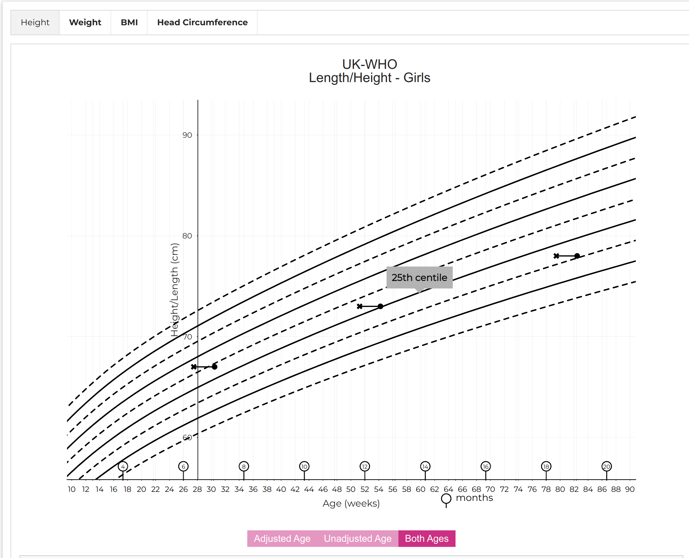

# React Chart Component



* [digital-growth-charts-react-component-library](https://github.com/rcpch/digital-growth-charts-react-component-library) is a React 18.2 Typescript component library which 'knows' how to display the results from the REST API, as a familiar digital growth chart.<br/>


[:octicons-mark-github-16: GitHub repository](https://github.com/{{ repository_name }})

[:material-web: Online Demo](https://growth.rcpch.ac.uk/)



!!! success "Use our Growth Chart React Component"
    The dGC React Component is the recommended way to display Digital Growth Charts to end users. We have built the component to be easy to integrate into existing web-based views, even if your stack does not currently use React. You can use the component as-is in a React app, or include it in plain HTML or any other JavaScript framework.

    Displaying growth charts is a complex task, and we have built the component to make it as easy as possible for developers to display charts correctly. The component is designed to be customisable, so you can change the look and feel to match your app.

## Background

### React.js

React is a popular UI library for Javascript. It has endured well and remains a popular choice for developers. Importantly, unlike some other Javascript frameworks which are primarily designed for Single Page Applications, React doesn't expect to have the entire webpage to itself. It can be used as a small component in any other web page, even if the main framework being used is completely different.

!!! question "Tell us what you think"
    Let us know what you think of our design decisions, on this or any other area of the dGC Project, by chatting to us on our [dGC Forum :fontawesome-brands-discourse:](https://forum.rcpch.tech), or our RCPCH Community [Signal chat channel :simple-signal:](https://signal.group/#CjQKIAjLf5lS9OZIAI6lsJKWP1LmeJXkUW_fzZH1ryEw3oFEEhBH-4F7WnlyYjKerjfzD6B0)

### What about other frameworks/UI libraries?

If you need us to develop a charting component in a different language or framework, we may be able to do this with you or your company. We would need to discuss the requirements and quote for this service. You should be aware that all such RCPCH-developed artefacts will also be open source. We ensure the licensing of open source components is compatible with commercial use.

!!! note "Contact us"
    To contact us for this service, email <mailto:commercial@rcpch.ac.uk>.

!!! question "What's new?"
    - Now support CDC (US) as of November 2024
    - Reintroduces width and height props for charting - note users control the aspect ratio

## Getting started

`git clone` the repo

```console
git clone https://github.com.rcpch/{{ repository_name }}
```

Install dependencies

```console
npm install
```

Run Storybook to view the component in isolation

```console
npm run storybook
```

### Running the Charts component locally

To run the Chart component locally alongside the React client, there are some extra steps. Since the Chart **component** (aka the chart itself) and the React **client** (aka the interactive form) both use React, the Charts will throw an error if you import them in the `package.json` of your app from a folder on your local machine.

<!-- We should stick to exclusively using these 2 terms to avoid confusion. Could also add a diagram showing which is which  -->

We would advise having both the Component and Client open when working through this part of the documentation. If you are using Visual Studio code, you can do this by opening a 'Workspace'.

First, in the Client directory, ensure you have a version of the chart component in your `node_modules`. Look for `node_modules/@rcpch/digital-growth-charts-react-component-library` 

Begin by opening a terminal in the client directory, and in the component directory. In both, execute the following command:

```console
npm ls -g --depth=0 --link=true
```

The result printed out will show you any symlinks between the 2 directories, and if you have never before ran `npm link`, then this will likely be empty.

In both the client and component terminals, execute the following command:

```console
nvm use node
```

This will use nvm (node version manager) to move to the latest version of node. 

Next, in your client terminal, execute the following command:

```console
npm link @rcpch/digital-growth-charts-react-component-library@7.0.0
```

!!! warning
    You may receive a permission denied error. If this is the case, execute the above command again but place `sudo` at the start of it.

Then, execute the following command in the component terminal:

```console
npm run build
```

And once you receive a message that the build has completed, go to the client terminal and enter:

```console
npm run dev
```

!!! warning
    You may receive a hooks error and a blank screen. This would be due to a clash between react versions between the client and component. You should navigate to the Component `node_modules` folder, and delete the `react` and `react-dom` folders.

A url will now present itself in the terminal, and you should follow that, which will take you to the client and component working together side by side.

### Making changes to the code, and visualising them

If you make changes to the component or the client, you should rerun the final 2 commands above, in the same order.


## Structure

This library has been written in Typescript. The main component is `RCPCHChart`, which takes the following `props`. Note that each component will only render a single chart type, so if you wanted to render a weight _and_ a height chart, these must be done as two separate instances of the component. We find that on modern screens you can render two charts side-by-side, but on smaller screens, you may wish to render one chart at a time, perhaps in tabs for height, weight, BMI, head circumference etc, as in our [demo client](https://growth.rcpch.ac.uk/).

### RCPCHChart component

??? note "`RCPCHChart` component props"
    ```js
        title: string; 
    measurementMethod: 'height' | 'weight' | 'ofc' | 'bmi';
    reference: 'uk-who' | 'turner' | 'trisomy-21' | 'cdc'; // 'cdc' coming soon!
    sex: 'male' | 'female';
    measurements: ClientMeasurementObject;
    midParentalHeightData?: MidParentalHeightObject | undefined;
    enableZoom?: boolean;
    chartType?: 'centile' | 'sds';
    enableExport?: boolean | undefined;
    exportChartCallback(svg?: any): any;
    clinicianFocus?: boolean | undefined | null;
    theme?: 'monochrome' | 'traditional' | 'tanner1' | 'tanner2' | 'tanner3' | 'custom';
    customThemeStyles?: {
        chartStyle?: ChartStyle 
        axisStyle?: AxisStyle
        gridlineStyle?: GridlineStyle
        measurementStyle?: MeasurementStyle
        centileStyle?: CentileStyle
        sdsStyle?: SDSStyle
    } // individual styles to override in each theme. If 'custom' theme is selected, 'monochrome' styles are defaulted and styles passed here override them 
    ```

### Measurement interface

The `Measurement` interface is structured to reflect the JSON `Measurement` object which is returned by the API. The `RCPCHChart` component uses the `reference` prop to determine which chart to render. So far, 3 references are supported: UK-WHO (`uk-who`), Turner Syndrome (`turner`) and Down Syndrome (`trisomy-21`). The reference data for the centiles are included in the library in plottable format in the `chartdata` folder.

!!! tip
    **You simply need to pass JSON from the dGC API directly in to the component as an array of `Measurement` JSON objects. The component 'knows' how to render this correctly. You don't need to parse, restructure, or even understand the JSON returned from the API: just pass it directly to the component inside an array containing one or more `Measurement` objects.**

### Themes vs Styles

Themes are collections of styles. The RCPCH have created some suggested themes:

1. Monochrome (default)
2. Traditional: this uses the preexisting pink and blue colours present on the paper charts
3. Tanner 1: Purple and yellow
4. Tanner 2: Orange and blue
5. Tanner 3: Red and yellow
6. Custom

These themes all have predefined attributes for `fontFamily`, `color`, `size`, `stroke` and `strokeWidth` for different aspects of the charts.
If these attributes are too prescriptive and users would like either to build their own theme,
or override styles within an existing theme, this can be done by passing in custom styles through the `customThemeStyles` prop.

All attributes are optional, therefore only those attributes where changes are requested need be passed in. The keys for the `customThemeStyles` object are as follows:

-   `chartStyle?: ChartStyle;`
-   `axisStyle?: AxisStyle;`
-   `gridlineStyle?: GridlineStyle;`
-   `centileStyle?: CentileStyle;`
-   `sdsStyle?: SDSStyle;`
-   `measurementStyle?: MeasurementStyle;`

The attributes of each of these are below:

#### `ChartStyle`

-   `backgroundColour?: string;` //background colour of chart
-   `titleStyle?: TextStyle `| undefined; // style of text in title: includes fontFamily, fontSize, colour, weight (regular/bold/italic)
-   `subTitleStyle?: TextStyle `| undefined; // style of text in subtitle: includes fontFamily, fontSize, colour, weight (regular/bold/italic)
-   `tooltipBackgroundColour?: string;` //background colour of tooltip
-   `tooltipStroke?: string;` //border colour of tooltip
-   `tooltipTextStyle?: TextStyle `| undefined; // tooltip text: includes fontFamily, fontSize, colour, weight (regular/bold/italic)
-   `termFill?: string;` // background colour of weight term area
-   `termStroke?: string;` // border colour of weight term area
-   `toggleButtonInactiveColour?: string;` // buttons - inactive colour
-   `toggleButtonActiveColour?: string;` // buttons - active colour
-   `toggleButtonTextStyle?: TextStyle | undefined;` // buttons text: includes fontFamily, fontSize, colour, weight (regular/bold/italic)

#### `MeasurementStyle`

-   `measurementFill?: string;` // measurement point fill colour - only apply to SDS charts
-   `highlightedMeasurementFill?: string;` // measurement point fill colour when hightlighted (SDS charts)
-   `eventTextStyle?: TextStyle;` // styles for text of events: includes fontFamily, fontSize, colour, weight (regular/bold/italic)

#### `CentileStyle`

-   `sdsStroke?: string;` // sds line colour
-   `centileStroke?: string;` // centile line colour
-   `delayedPubertyAreaFill?: string;` // delayed puberty area colour
-   `midParentalCentileStroke?: string;` // Midparental height centile line colour
-   `midParentalAreaFill?: string;` // Midparental height area colour

#### `SDSStyle`

-   `heightStroke?: string;` // sds line colour
-   `weightStroke?: string;` // sds line colour
-   `ofcStroke?: string;` // sds line colour
-   `bmiStroke?: string;` // sds line colour

#### `GridlineStyle`

-   `gridlines?: boolean;` // show or hide gridlines
-   `stroke?: string;` // gridline colour
-   `strokeWidth?: number;` // gridline width
-   `dashed?: boolean;` // dashed vs continuous gridlines

#### `AxisStyle`

-   `axisStroke?: string;` // Axis colour
-   `axisLabelTextStyle?: TextStyle | undefined;` // Axis label text: : includes fontFamily, fontSize, colour, weight (regular/bold/italic)
-   `tickLabelTextStyle?: TextStyle | undefined;` // Tick label text : includes fontFamily, fontSize, colour, weight (regular/bold/italic)

#### `TextStyle`

-   `name?: string;`
-   `colour?: string;`
-   `size?: number;`
-   `style?: 'bold' | 'italic' | 'normal';`

For example, if a user wished to override the background colour of the existing 'monochrome' theme:

```js
const customChartStyle: ChartStyle = {
  backgroundColour: "tomato"
}

const customStyles = {
  chartStyle: customChartStyle
}
```

And in the JSX:

```js
<RCPCHChart
    reference={'uk-who'}
    measurementMethod={'height'}
    sex={'female'}
    title={'Arthur Scargill - 12345678A'}
    measurements={[]} // this is the plottable child data
    midParentalHeightData={[]} // this is the optional plottable midparental height data from the RCPCH API
    theme={'monochrome'}
    customThemeStyles={customStyles} <---- override styles here
    enableZoom
    chartType={'centile'}
    enableExport={false}
    exportChartCallback={() => {}} // this is a callback for the export chart function if true
    clinicianFocus={false}
/>
```

### Mid-Parental Height

`midParentalHeightData`: This is the return value from the RCPCH API and takes the structure:

??? note "`midParentalHeightData`"
    ```js
        export interface MidParentalHeightObject {
            mid_parental_height?: number;
            mid_parental_height_sds?: number;
            mid_parental_height_centile?: number;
            mid_parental_height_centile_data?: Reference[]
            mid_parental_height_upper_centile_data?: Reference[]
            mid_parental_height_lower_centile_data?: Reference[]
            mid_parental_height_lower_value?: number
            mid_parental_height_upper_value?: number
        }
    ```

This returns a mid-parental height, mid-parental SDS and centile, along with the centile data if the user wishes to plot a mid-parental centile. The structure of the Reference and Centile interfaces is:

??? note "`Reference` and `Centile` interface structures"
    ```js
    export interface Reference {
    [name: string]: ISexChoice
    }

        export interface ICentile {
            centile: number,
            data: IPlottedCentileMeasurement[],
            sds: number
        }

        export interface IPlottedCentileMeasurement {
            "l": string | number,
            "x": number,
            "y": number
        }

        export interface ISexChoice {
            male: IMeasurementMethod,
            female: IMeasurementMethod
        }

        export interface IMeasurementMethod{
            height?: ICentile[],
            weight?: ICentile[],
            bmi?: ICentile[],
            ofc?: ICentile[],
        }
    ```

Centile data are returned from the RCPCH API in this same structure, though no API call is made from this component - all the centile data for all the references is included.

### `enableZoom`

`enableZoom`: a boolean optional prop which defaults to false. If true, the user can press and mouse click to zoom in or out once measurements are being displayed. A reset zoom button also appears.

### `chartType`

`chartType`: a string mandatory prop and must be one of `'centile' | 'sds'`. It toggles between centile and SDS charts.

### `enableExport`

`enableExport`: a boolean optional prop, defaults to false. If true, `exportChartCallback` must be implemented and a copy-paste button is rendered below the chart.

### `exportChartCallBack`

`exportChartCallback` callback function implemented if `enableExport` is true. It receives an SVG element. This can be saved in the client to clipboard by converting to canvas using HTML5. An example implementation of this is [here](https://github.com/rcpch/digital-growth-charts-react-client/blob/live/src/functions/canvasFromSVG.js) in our demo client.

### `clinicianFocus`

`clinicianFocus`: a boolean optional prop which defaults to false. If true, the advice strings that are reported to users in tooltips are more technical and aimed at clinicians familiar with centile charts. If false, the advice strings will be less technical and more suitable for parents, guardians, carers or other laypersons.

!!! example "Requests for additional functionality in props"
    In time, more props can be added if users request them. If you have requests, please post issues on our [GitHub](https://github.com/rcpch/digital-growth-charts-react-component-library/issues) or get involved to contribute as below.

## Troubleshooting

### Circular import errors

Victory Charts are a dependency (see below), built on top of D3.js. On build, it is likely you will get an error relating to circular dependencies for some files in the d3-interpolate module. This issue is logged [here](https://github.com/d3/d3-interpolate/issues/58).

### Build error

v7.0.0 uses Rollup 4.11, and has the following build script in `package.json`: `"build": "ROLLUP_WATCH=false rollup -c --bundleConfigAsCjs",`
If users are using later versions, this has has changed and should be `“build”: “ROLLUP -w -c --bundleConfigAsCjs”,` (thanks to Caroline Kirkhope at System C for noticing this)

## Contributing

See [Contributing](../developer/contributing.md) for information on how to get involved in the project.

You can get in touch with the primary developers to talk about the project using any of the methods on our [contact page](../about/contact.md).

## Acknowledgements

This Typescript library was built from the starter created by [Harvey Delaney](https://blog.harveydelaney.com/creating-your-own-react-component-library/)

The charts are built using [Victory Charts](https://formidable.com/open-source/victory/docs/victory-chart/) for React. We tried several chart packages for React, but we chose Victory because of their documentation and their ability to customise components.

## Licensing

This chart component software is is subject to copyright and is owned by the RCPCH, but is released under the MIT license.
[](https://opensource.org/licenses/MIT)

There is important chart line rendering data bundled in the component, which subject to copyright and is owned by the RCPCH. It is specifically excluded from the MIT license mentioned above. If you wish to use this software, please [contact the RCPCH](../about/contact.md) so we can ensure you have the correct license for use. Subscribers to the Digital Growth Charts API will automatically be assigned licenses for the chart plotting data.
