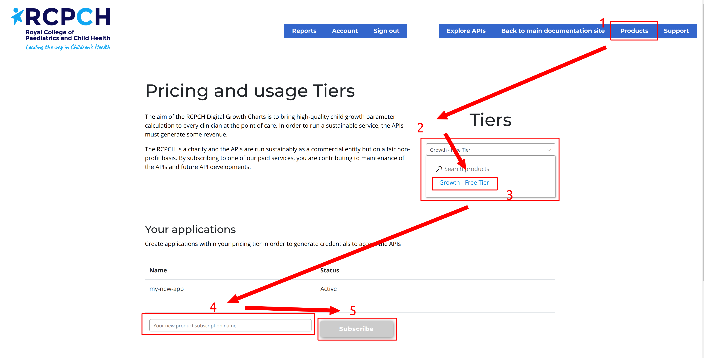

# Getting Started integrating Digital Growth Charts

The RCPCH Digital Growth Charts platform centres around a REST API which provides calculated growth parameters derived from supplied child measurements such as height and weight.

The next few pages will take you through the process of using the API. If you are an experienced user of REST APIs, this should be straightforward. We have deliberately designed this API to be simple and clear.

## Sign up for the API service

To use the Digital Growth Charts API, you need to sign up for an account and obtain **API keys**.

These API keys allow us to manage usage of the API and prevent abuse. For exploring the platform, the Free Tier gives instant access. More information on pricing is available [here](../products/pricing.md).

> At present this sign-up step is on an external website because we use the Microsoft Azure API management platform. In the future, this may become a more streamlined on-boarding workflow.

[Go to dev.rcpch.ac.uk to sign up :octicons-link-external-16:](https://dev.rcpch.ac.uk/signup){ .md-button .md-button--primary}

**Once signed up, come back here to follow the rest of the Getting Started tutorial.**
## Choose a Product and Create an App

!!! tip "Onboarding support"
    If you have any issues with getting the Tier you need, please [contact us](../about/contact.md).

1. Navigate to the [Products](https://dev.rcpch.ac.uk/product) menu item, and choose the Tier of the API subscription that you require.

    !!! warning "**IMPORTANT: ONLY THE FREE TIER GIVES YOU INSTANT ACCESS**"
        Other tiers require waiting for **approval**, onboarding, and payment verification. Initially, we recommend the **Free Tier** for everyone. You can create multiple Free Tier apps, however, the usage is shared.

2. Select a Tier from the 'Tiers' drop-down to get started.

3. Create a unique name for your application. It doesn't matter what you call it as long as it has meaning for you, and it can be changed later in the Account part of the portal.

4. Click 'Subscribe' to create the app.

## Next: [Getting API keys](../integrator/api-keys.md)

-----
