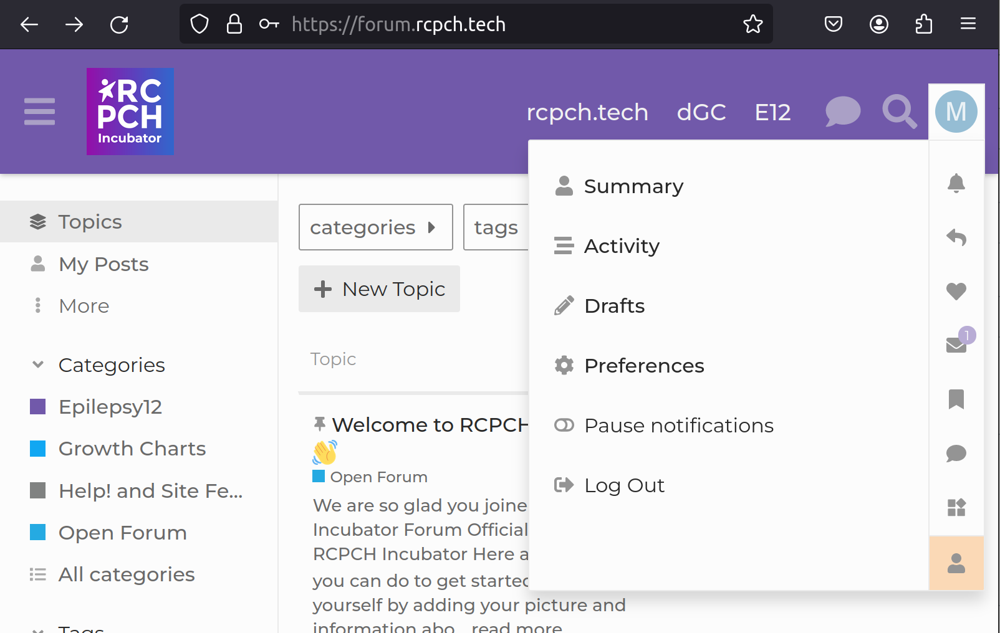
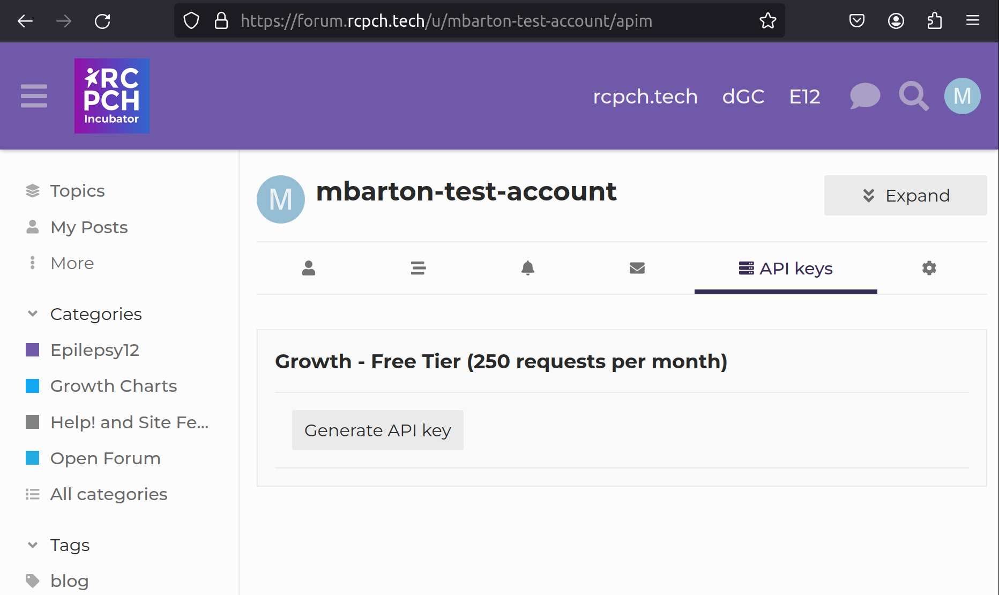

# Getting Started with Digital Growth Charts

The RCPCH Digital Growth Charts platform centres around a REST API which provides calculated growth parameters derived from supplied child measurements such as height and weight.

The next few pages will take you through the process of using the API. If you are an experienced user of REST APIs, this should be straightforward. We have deliberately designed this API to be simple and clear.

## Sign up for a free tier API key

To use the Digital Growth Charts API, you need to sign up for an account and obtain **API keys**.
API keys allow us to manage usage and billing for the API. We do have a perpetually free tier of access for testing and exploring the platform. It has full access to the API but the number of requests are limited.

!!! danger "Fair Use Policy for the dGC API's Free Tier"
    We haven't yet encountered any issues with abuse of our free tier, but we thought it would be sensible to outline some elements of our fair use policy for the free tier of the Digital Growth Charts API.

    * The free tier is intended for testing and exploration of the API, and is not intended for production use.

    * Creation of multiple free tier accounts will result in deletion of all accounts and a ban/block.

    * Use of any endpoints other than the api.rcpch.ac.uk endpoint is prohibited.
    
    * 'Reselling' the API through a proxy service is banned and could result in legal action due to the Medical Device status of the API.

#### Sign up to our forum at [https://forum.rcpch.tech/](https://forum.rcpch.tech/)
!!! tip Approval required
    Sign up to the forum is subject to our approval process, please [contact us](../contact/contact.md) if you are not approved automatically.

#### Navigate to your user summary page using the drop down in the top right hand menu

#### Click on the API keys tab

#### Click Generate API key

!!! danger "API keys are secrets!"
    API keys identify you to the API, so they should be considered *'secrets'*. If someone else can access and use your API keys, then they **are** effectively 'you' as far as our servers are concerned. Therefore, you must keep your API keys private, especially when using keys in a real application.

    The most common cause of accidental API key exposure is inadvertently committing a hard-coded API key to version control, such as Git, and then pushing it to a public site such as GitHub. The slution to this is not to ever hard-code your API keys in your code, but to use environment variables or a secure vault service to store them.

    If you do accidentally expose your API keys, you should immediately delete them and generate new ones.

!!! tip Production tiers
    To launch your integration we offer a wide range of paid access tiers that do not have the restrictions of the free tier.
    See our [pricing](https://www.rcpch.ac.uk/resources/growth-charts/digital/about#subscriptions-and-pricing).

-----

## Next: [Making API calls](../integrator/making-api-calls.md)
