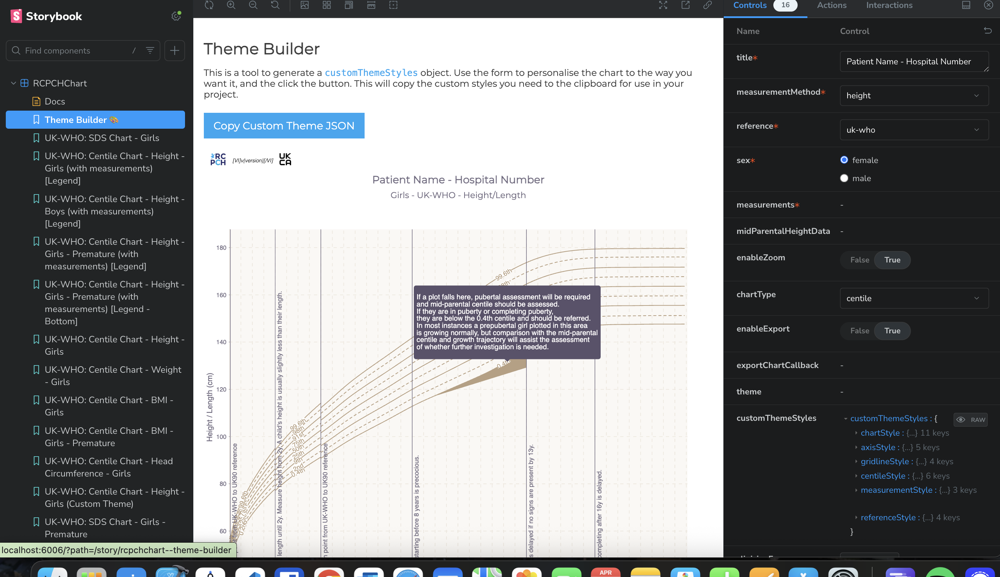

## Installing the RCPCH Digital Growth Charts React Component

The API and the charting component are built to work together but ship separately. The [API calculation endpoint](https://growth.rcpch.ac.uk/integrator/api-reference/) returns centiles and SDS for a child's growth measurements as a structured JSON `Measurement` object. The [React Component Library](https://github.com/rcpch/digital-growth-charts-react-component-library) takes that response as a prop and renders it as a familiar growth chart.

To see it in action, browse the [Storybook](./chart-component-storybook.md) or try the [interactive demonstration](https://growth.rcpch.ac.uk/). The component supports a range of [use cases](https://growth.rcpch.ac.uk/products/react-component/#why-a-chart-library), and the charts can be tailored for families and children or for clinicians, from health visitors and midwives to paediatric endocrinology growth specialists.

The component does not yet support mobile screens; chart visualisation will need to be reimagined for smaller displays, and this is on the RCPCH roadmap.

### React

The component is best embedded in a React application. It is published on [npm](https://www.npmjs.com/package/@rcpch/digital-growth-charts-react-component-library) and added to your `package.json` dependencies. Your app calls the API and passes the response into the component for charting.

For a head start, the [RCPCH Digital Growth Charts React client](https://growth.rcpch.ac.uk/) is a working reference implementation with a simple data-entry form; its [source is on GitHub](https://github.com/rcpch/digital-growth-charts-react-client) and can be used as a starter.

The component is built for [React 18.2](https://18.react.dev/) and is periodically updated to support later versions of React as they are released.

#### Props

A single `<RCPCHChart>` instance renders one chart. To show more than one chart (for example height *and* weight), render one instance per chart.

The table below lists the props accepted by `<RCPCHChart>`. The authoritative definition lives in the component source at [`RCPCHChart.types.ts`](https://github.com/rcpch/digital-growth-charts-react-component-library/blob/live/src/RCPCHChart/RCPCHChart.types.ts), and the [Storybook](./chart-component-storybook.md) has live, interactive examples.

| Prop | Type | Required | Default | Description |
| --- | --- | --- | --- | --- |
| `title` | `string` | Yes | — | Title shown at the top of the chart. |
| `measurementMethod` | `'height' \| 'weight' \| 'ofc' \| 'bmi'` | Yes | — | The measurement to plot. |
| `reference` | `'uk-who' \| 'turner' \| 'trisomy-21' \| 'cdc' \| 'trisomy-21-aap' \| 'who'` | Yes | — | The growth reference dataset to chart against. |
| `sex` | `'male' \| 'female'` | Yes | — | The child's sex. |
| `measurements` | `ClientMeasurementObject` | Yes | — | The API response data, keyed by measurement method. |
| `exportChartCallback` | `(svg?: any) => any` | Yes | — | Called with the chart SVG when an export is triggered. |
| `allowDuplicates` | `boolean` | No | `false` | Whether to plot measurements that share the same age and value. |
| `midParentalHeightData` | `MidParentalHeightObject` | No | — | Mid-parental height data to overlay on height charts. |
| `enableZoom` | `boolean` | No | `true` | Allow the user to zoom and pan the chart. |
| `chartType` | `'centile' \| 'sds'` | No | `'centile'` | Whether to render a centile or an SDS chart. |
| `enableExport` | `boolean` | No | `true` | Show the export control and enable SVG export. |
| `clinicianFocus` | `boolean \| null` | No | `true` | Optimise the chart for clinicians; set to `false` for a simpler family-facing view. |
| `theme` | `'monochrome' \| 'traditional' \| 'tanner1' \| 'tanner2' \| 'tanner3' \| 'custom'` | No | `'monochrome'` | The visual theme. Select `custom` to apply `customThemeStyles`. |
| `height` | `number` | No | `800` | Chart height in pixels. |
| `width` | `number` | No | `1000` | Chart width in pixels. |
| `logoVariant` | `'top' \| 'bottom' \| 'legend'` | No | `'top'` | Placement of the RCPCH logo or acknowledgement. |
| `customThemeStyles` | `object` | No | — | Per-element style overrides applied when `theme` is `custom` (see below). |

When `theme` is set to `custom`, `customThemeStyles` lets you override individual style groups: `chartStyle`, `axisStyle`, `gridlineStyle`, `measurementStyle`, `centileStyle`, `sdsStyle` and `referenceStyle`. Any group you omit falls back to the monochrome defaults.

#### Versioning

The charts use [semver](https://semver.org/) versioning, with documentation published for each release. Breaking changes are uncommon, but you will need to update and rebuild your application when new releases are published.

#### Styling

The charts ship with a monochrome theme by default. RCPCH also provide four other themes (Traditional, Tanner 1, Tanner 2, Tanner 3), and a `custom` theme lets you override most aspects of the look and feel. The [Storybook docs](./chart-component-storybook.md) document every prop the charts accept and how to wire them into your React project.

The RCPCH logo and chart version appear in the top left corner by default. To reduce the logo's prominence, the `logoVariant` prop can show an RCPCH acknowledgement statement at the foot of the chart instead.

##### Theme Builder 🎨

Select the `custom` theme to override style props such as fonts, colours, lines and backgrounds. The Storybook Theme Builder lets you adjust each element visually, then copies the resulting settings object to your clipboard to pass to the `customThemeStyles` prop. <br/>


### What if I can't use React?

Many healthcare environments cannot use frameworks like React. For these cases the charts are also published on [jsDelivr](https://www.jsdelivr.com/package/npm/@rcpch/digital-growth-charts-react-component-library) and [unpkg](https://unpkg.com/@rcpch/digital-growth-charts-react-component-library@latest/build/rcpch-digital-growth-charts.umd.js), so you can import the JavaScript directly in the `<head>` of your page. This exposes the `RCPCHGrowthCharts` wrapper, which accepts the same props as above plus the `id` of the DOM element where the charts should render.

```html
<!doctype html>
<html>
    <head>
        <title>Growth Chart Example</title>
        <!-- React dependencies. Must come first -->
        <script crossorigin src="https://unpkg.com/react@18/umd/react.production.min.js" defer></script>
        <script crossorigin src="https://unpkg.com/react-dom@18/umd/react-dom.production.min.js" defer></script>
        <!-- RCPCH Growth Charts library -->
        <!-- You must use the integrity check to ensure you are using the expected code as this component   -->
        <!-- can render patient data. You can get the value from this file, adjusting the version as needed -->
        <!-- https://cdn.jsdelivr.net/npm/@rcpch/digital-growth-charts-react-component-library@7.5.0/build/sri-hash.txt -->
        <script 
            src="https://cdn.jsdelivr.net/npm/@rcpch/digital-growth-charts-react-component-library@7.5.0/build/rcpch-digital-growth-charts.umd.min.js" 
            integrity="sha384-yu1MIbRclkM3UCyciRAULihnERx26NqFKjP/EuddYVumiom3Oy5p9KBGSUHABc8g" 
            crossorigin="anonymous"
            defer>
        </script>
        <script defer>
            document.addEventListener('DOMContentLoaded', function () {
                const demoMeasurements = [ /* RCPCH digital growth charts API response goes here */ ];
                window.RCPCHGrowthCharts.render({
                    targetElementId: 'growth-chart-container',
                    title: 'Demo UK-WHO Growth Chart for Children',
                    measurementMethod: 'height',
                    reference: 'uk-who',
                    sex: 'female',
                    measurements: { height: demoMeasurements },
                    midParentalHeightData: {},
                    enableZoom: false,
                    chartType: 'centile',
                    enableExport: false,
                    clinicianFocus: false,
                    theme: 'tanner3',
                    height: 800,
                    width: 800,
                });
            });
        </script>
    </head>
    <body>
        <div id="growth-chart-container"></div> <!-- The charts will appear here -->
    </body>
</html>
```
